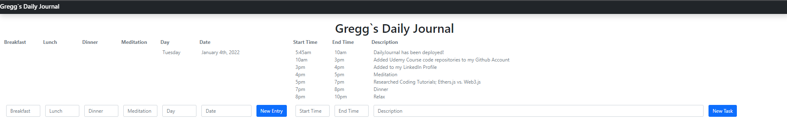

# Daily Journal

Daily Journal is an implementation of the list of tasks completed on a daily basis. This project exemplifies the fundamental skills needed to create a Full-stack Blockchain dApplication.

## Badges

]

## Motivation

The idea behind this project is to exemplify the fundamental skills that are necessary to be a blockchain developer. This includes:
  
  1. Setting up a proper environment, project structure and configuration file.
  2. Installing the necessary dependencies using [npm](https://www.npmjs.com/).
  3. Initial Smoke Test - Compiling and migrating to a local Blockchain ([Ganache](https://trufflesuite.com/ganache/index.html)) using [Truffle](https://trufflesuite.com/) Framework.
  4. Writing other Smart Contracts in [Solidity](https://docs.soliditylang.org/en/v0.8.12/).
  5. Writing Migration files.
  6. Writing proper tests using [Mocha.js](https://mochajs.org/) Framework and [Chai](https://www.chaijs.com/) Assertion Library.
  7. Setting up [Metamask](https://metamask.io/) using an account on your Ganache local blockchain
  7. Using [web3.js](https://web3js.readthedocs.io/en/v1.7.0/) and [React.js](https://reactjs.org/) to load Web3 Provider, load Blockchain data, and connect Smart Contracts to the Front-end.
  8. Modularizing Front-End application code.
  9. Deploying application to Ethereum Testnet using [HDWallet Provier](https://www.npmjs.com/package/@truffle/hdwallet-provider), [Infura](https://infura.io/) and a .env file.
  10. Verifying Smart Contracts using [Etherscan](https://etherscan.io/) and [truffle-flattener](https://www.npmjs.com/package/truffle-flattener).
  11. Utilizing Github.
  12. Writing proper README.md file.

## Build Status

## Code Style

Standard.

## Screenshots

## Tech/Framework 

1.  NPM - Node Package Manager
2.  Truffle Framework
3.  Ganache
4.  JavaScript
5.  Solidity
6.  Mocha.js
7.  Chai.js
8.  Web3.js
9.  React.js
10. HDWallet Provider
11. EtherScan

## Features

1. Create Entry - Creates an entry for the day which tasks can be created for.
2. Create Task  - Creates a task.

## Prerequisites

NPM / NodeJS
Truffle
Solidity
Ganache
Metamask account
Infura account
Mocha / Chai

## Installation

Enter the following commands into the terminal:

`git clone https://github.com/dentnexus7/DailyJournal.git`

`npm install`

Ensure Ganache is open via quickstart.

`truffle migrate --reset

Ensure you've imported the first account from your Ganache accounts to your Metmask.

`npm run start`

## API Reference

[web3.js](https://web3js.readthedocs.io/en/v1.7.0/)

## Tests

There are tests included for all the current features.

`truffle test`

## Usage

Make sure you have followed the installation instructions.

`git clone https://github.com/dentnexus7/DailyJournal.git`

`npm run start`

## Contributing

Pull requests are welcome. For major changes, please open an issue first to discuss what you would like to change.

If you want to make a contribution, please follow the next steps:

  1. Fork the Project
  2. Create your Feature Branch (git checkout -b <branch_name>)
  3. Commit your Changes (git commit -m '<commit_message>')
  4. Push to the Branch (git push origin <project_name>/<location>)
  5. Create a Pull Request

Please make sure to update tests as appropriate.

## Contributors

Thanks to the following people who have contributed to this project:

Gregg Dent - dentnexus7@gmail.com

You can find me here at: [Github](https://github.com/dentnexus7) [LinkedIn](https://www.linkedin.com/in/gregory-dent-77b452103/) 

## License

This project is [licensed under the MIT License](./LICENSE) - see the LICENSE.md file for details

[MIT](https://choosealicense.com/licenses/mit/) [@ Gregg Dent](https://github.com/dentnexus7)
